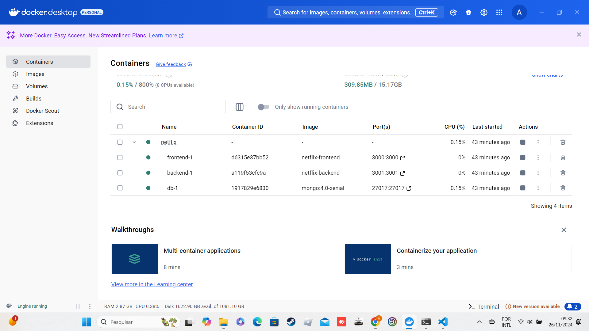

# DOCKER Completo - Do Zero ao Avançado

Esse aplicativo foi desenvolvido no curso <a href="https://www.udemy.com/course/docker-zero-avancado" target="_blank">DOCKER Completo - Do Zero ao Avançado</a> , tem como objetivo aprender tudo sobre Docker, construindo, testando e implementando containers na prática.

|Aplicação|Docker desktop|
|----|----|
|||

## 🔨 Funcionalidades do projeto

Esse aplicativo exibe um input para adicionar filmes e listar filmes.

## 🛠️ Abrir e rodar o projeto

Dentro da pasta do projeto execute `docker compose up` , é necessário instalar docker na máquina e docker compose, o aplicativo Docker Desktop, já tem o plugin do docker compose instalado.

Depois, acesse <a href="http://localhost:3000/" target="_blank">http://localhost:3000/</a> no seu navegador. 